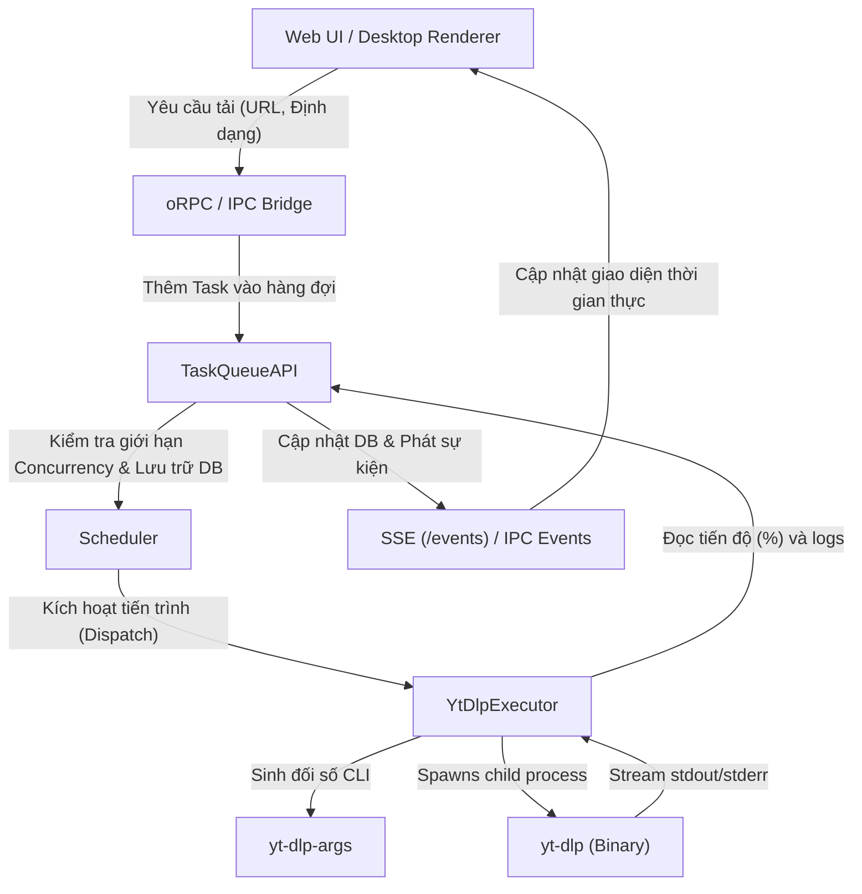

# VidBee: Phân tích & Hướng dẫn đọc hiểu Source Code

**VidBee** là một ứng dụng tải video/audio nguồn mở hiện đại, đa nền tảng (hỗ trợ cả Desktop Electron và Web/API Client chạy qua Docker), sử dụng động cơ lõi là **yt-dlp** và **FFmpeg** để hỗ trợ tải từ hơn 1000 trang web khác nhau. Mã nguồn được tổ chức theo mô hình **Monorepo** sử dụng công cụ quản lý package `pnpm` với các gói thư viện dùng chung (`packages`) và các ứng dụng chạy độc lập (`apps`).

---

## 1. Bản đồ Kiến trúc Dự án (Workspace Directory Tree)

Dưới đây là sơ đồ tổ chức thư mục của VidBee monorepo:

*   **`packages/` (Các thư viện lõi chia sẻ chung)**
    *   [`downloader-core/`](file:///Users/datnguyenquoc/Documents/GitHub/VidBee/packages/downloader-core): Xử lý giao tiếp trực tiếp với tiến trình `yt-dlp` và `ffmpeg`.
    *   [`task-queue/`](file:///Users/datnguyenquoc/Documents/GitHub/VidBee/packages/task-queue): Hàng đợi công việc (Task Queue) quản lý lập lịch tải, kiểm soát concurrency, chạy máy trạng thái (FSM) và xử lý phục hồi sau crash (crash recovery).
    *   [`subscriptions-core/`](file:///Users/datnguyenquoc/Documents/GitHub/VidBee/packages/subscriptions-core): Xử lý đăng ký RSS feed (YouTube channels, TikTok, XML...), tự động quét bài mới và lập lịch tự động tải.
    *   [`db/`](file:///Users/datnguyenquoc/Documents/GitHub/VidBee/packages/db): Định nghĩa lược đồ cơ sở dữ liệu (Drizzle ORM) dành cho SQLite.
    *   [`ui/`](file:///Users/datnguyenquoc/Documents/GitHub/VidBee/packages/ui): Thư viện thành phần giao diện người dùng (UI components) dùng chung cho Web và Desktop.
    *   [`i18n/`](file:///Users/datnguyenquoc/Documents/GitHub/VidBee/packages/i18n): Gói quản lý quốc tế hóa đa ngôn ngữ.
*   **`apps/` (Các ứng dụng đích đầu cuối)**
    *   [`api/`](file:///Users/datnguyenquoc/Documents/GitHub/VidBee/apps/api): Máy chủ REST API xây dựng trên **Fastify**, xuất bản các hàm gọi thủ tục qua **oRPC** và đồng bộ tiến trình qua Server-Sent Events (SSE).
    *   [`web/`](file:///Users/datnguyenquoc/Documents/GitHub/VidBee/apps/web): Ứng dụng web viết bằng React & **TanStack Start**, giao tiếp trực tiếp với `apps/api`.
    *   [`desktop/`](file:///Users/datnguyenquoc/Documents/GitHub/VidBee/apps/desktop): Ứng dụng desktop bao bọc bởi **Electron** và xây dựng giao diện dựa trên cùng các components dùng chung, giao tiếp qua Electron IPC.
    *   [`cli/`](file:///Users/datnguyenquoc/Documents/GitHub/VidBee/apps/cli): Giao diện dòng lệnh tương tác trực tiếp.

---

## 2. Kiến trúc và Luồng Dữ liệu Lõi (Core Data Flow)

### Luồng Tải Video (Download Flow)

Sự phân tách trách nhiệm giữa các gói giúp việc thực thi tải video diễn ra nhất quán trên cả Web và Desktop:

---

## 3. Phân tích chi tiết các Module Lõi

### A. Động cơ thực thi tải: `@vidbee/downloader-core`

Thư mục: [`packages/downloader-core/src/`](file:///Users/datnguyenquoc/Documents/GitHub/VidBee/packages/downloader-core/src)

*   **[`yt-dlp-executor.ts`](file:///Users/datnguyenquoc/Documents/GitHub/VidBee/packages/downloader-core/src/yt-dlp-executor.ts)**:
    *   Lớp [`YtDlpExecutor`](file:///Users/datnguyenquoc/Documents/GitHub/VidBee/packages/downloader-core/src/yt-dlp-executor.ts#L144) chịu trách nhiệm khởi chạy tiến trình con (`child_process.spawn`) thực thi `yt-dlp`.
    *   Đọc luồng dữ liệu chuẩn `stdout` / `stderr` để phân tích tỷ lệ phần trăm tiến độ thông qua việc bắt chuỗi định dạng (ví dụ: tốc độ tải, dung lượng đã tải, thời gian dự kiến hoàn thành ETA) và ánh xạ sang cấu trúc `TaskProgress`.
    *   Nhận diện các dấu hiệu chuyển tiếp sang bước hậu xử lý (ví dụ: `Merging formats`, `Embedding thumbnail`, `FFmpeg`) để báo hiệu trạng thái `processing`.
    *   Tự động phân loại lỗi từ mã thoát (exit code) và dữ liệu lỗi trong `stderr` (ví dụ: lỗi giới hạn tần suất HTTP 429, lỗi yêu cầu đăng nhập/cookies, lỗi giới hạn địa lý...).
    *   Quản lý việc hủy hoặc tạm dừng tiến trình bằng cách gửi tín hiệu `SIGTERM` và chuyển sang `SIGKILL` nếu tiến trình không phản hồi sau một khoảng thời gian chờ (Kill Grace Period - mặc định 10 giây).
*   **[`downloader-core.ts`](file:///Users/datnguyenquoc/Documents/GitHub/VidBee/packages/downloader-core/src/downloader-core.ts)**:
    *   Định nghĩa lớp [`DownloaderCore`](file:///Users/datnguyenquoc/Documents/GitHub/VidBee/packages/downloader-core/src/downloader-core.ts#L489) dùng để truy vấn thông tin phi trạng thái (Stateless metadata) của Video/Playlist thông qua các tham số JSON kết quả từ lệnh `yt-dlp`.
    *   Quét tìm đường dẫn thực thi của các tệp nhị phân tích hợp sẵn trong thư mục ứng dụng (Bundled Binaries) hoặc các tệp trên biến môi trường hệ thống (`YTDLP_PATH`, `FFMPEG_PATH`).
*   **[`yt-dlp-args.ts`](file:///Users/datnguyenquoc/Documents/GitHub/VidBee/packages/downloader-core/src/yt-dlp-args.ts)**:
    *   Xây dựng mảng đối số dòng lệnh tối ưu cho `yt-dlp` dựa trên cấu hình người dùng lựa chọn (độ phân giải tối đa, đường dẫn lưu, định dạng nén container MP4/MKV, tải âm thanh rời, khoảng thời gian cắt clip `startTime`/`endTime`, cookie trình duyệt...).

### B. Quản lý hàng đợi và Máy trạng thái: `@vidbee/task-queue`

Thư mục: [`packages/task-queue/src/`](file:///Users/datnguyenquoc/Documents/GitHub/VidBee/packages/task-queue/src)

*   **Máy trạng thái hữu hạn: [`fsm/index.ts`](file:///Users/datnguyenquoc/Documents/GitHub/VidBee/packages/task-queue/src/fsm/index.ts)**:
    *   Hàm [`transition`](file:///Users/datnguyenquoc/Documents/GitHub/VidBee/packages/task-queue/src/fsm/index.ts#L93) đảm bảo việc chuyển đổi trạng thái tải là an toàn và tuân thủ bảng kiểm soát chặt chẽ:
        *   `queued` $\rightarrow$ `running` / `paused` / `cancelled`
        *   `running` $\rightarrow$ `processing` / `completed` / `retry-scheduled` / `failed` / `paused` / `cancelled`
        *   `processing` $\rightarrow$ `completed` / `retry-scheduled` / `failed` / `paused` / `cancelled`
        *   `retry-scheduled` $\rightarrow$ `queued` / `paused` / `cancelled`
        *   Các trạng thái kết thúc (Terminal states): `completed` (yêu cầu đầu ra kích thước > 0 bytes), `failed`, `cancelled`.
*   **Điều phối trung tâm: [`api/index.ts`](file:///Users/datnguyenquoc/Documents/GitHub/VidBee/packages/task-queue/src/api/index.ts)**:
    *   Lớp [`TaskQueueAPI`](file:///Users/datnguyenquoc/Documents/GitHub/VidBee/packages/task-queue/src/api/index.ts#L107) tích hợp và điều phối các thành phần:
        *   `Scheduler`: Hạn chế số lượng luồng tải đồng thời (`maxConcurrency`) theo cấu hình chung hoặc theo nhóm playlist.
        *   `RetryScheduler`: Lập lịch thử lại tự động khi gặp lỗi có thể khôi phục (ví dụ: mất mạng tạm thời), áp dụng thuật toán giãn cách thời gian luỹ tiến (Exponential Backoff) kèm độ lệch ngẫu nhiên (Jitter).
        *   `Watchdog`: Phát hiện các tiến trình bị treo (stalled) do không có dữ liệu ra `stdout`/`stderr` trong một thời gian dài để chủ động hủy và thử lại.
        *   `ProcessRegistry` & `PersistAdapter`: Lưu vết tiến trình vào database để phục hồi trạng thái tải sau khi xảy ra sự cố sập ứng dụng đột ngột (Crash Recovery). Khi khởi động lại ứng dụng, các tiến trình tải dở dang (`running`/`processing`) được chuyển thành `paused('crash-recovery')` và giữ nguyên dung lượng đã tải để người dùng có thể bấm tải tiếp.

### C. Tự động tải qua RSS: `@vidbee/subscriptions-core`

Thư mục: [`packages/subscriptions-core/src/`](file:///Users/datnguyenquoc/Documents/GitHub/VidBee/packages/subscriptions-core/src)

*   **Bộ phân tích và phân phối: [`auto-download.ts`](file:///Users/datnguyenquoc/Documents/GitHub/VidBee/packages/subscriptions-core/src/auto-download.ts)**:
    *   Hàm [`decideAutoDownloads`](file:///Users/datnguyenquoc/Documents/GitHub/VidBee/packages/subscriptions-core/src/auto-download.ts#L74) nhận đầu vào là RSS feed mới nhất từ nguồn phát và so khớp với cấu hình của thẻ đăng ký (Subscription Rule) để quyết định tải tự động:
        1.  Chỉ lấy những video đăng tải mới hơn mốc thời gian lớn nhất của các video đã biết trước đó (`latestVideoPublishedAt`).
        2.  Lọc bỏ những video đã từng tải hoặc đã nằm trong hàng đợi lịch sử tải của hệ thống.
        3.  Kiểm tra bộ lọc từ khóa chứa trong tiêu đề video nếu người dùng cấu hình lọc từ khóa (`keywords`).
        4.  Gửi danh sách tệp đủ điều kiện tải tự động sang Task Queue với độ ưu tiên cao (`priority: 10`).

---

## 4. Máy chủ REST API và Ứng dụng Web

### A. Máy chủ REST API: `apps/api`

Thư mục: [`apps/api/src/`](file:///Users/datnguyenquoc/Documents/GitHub/VidBee/apps/api/src)

*   **Khởi động máy chủ: [`server.ts`](file:///Users/datnguyenquoc/Documents/GitHub/VidBee/apps/api/src/server.ts)**:
    *   Khởi tạo máy chủ Fastify, đăng ký CORS và cấu hình oRPC handlers kết nối tới Router xử lý tải xuống và Router quản lý đăng ký RSS.
    *   **Bảo mật Image Proxy (`/images/proxy`)**: Đầu cuối trung gian tải ảnh thu nhỏ (thumbnails) từ bên ngoài giúp client hiển thị một cách an toàn. Có tính năng chống tấn công SSRF (Server-Side Request Forgery) cực tốt bằng cách tra cứu DNS phân giải hostname của ảnh và từ chối tải nếu địa chỉ IP phân giải thuộc dải mạng nội bộ/tư nhân (Private IPs như `127.0.0.1`, `10.0.0.0/8`, `192.168.0.0/16`...).
    *   **Đồng bộ Server-Sent Events (`/events`)**: Thiết lập kết nối luồng SSE thời gian thực. Bất kỳ khi nào Task Queue thay đổi trạng thái hoặc tiến độ tải, API sẽ nhận sự kiện này, chuyển đổi cấu trúc nội bộ sang cấu trúc định dạng API Client và đẩy trực tiếp tới trình duyệt người dùng qua kênh SSE.
*   **oRPC Router: [`lib/rpc-router.ts`](file:///Users/datnguyenquoc/Documents/GitHub/VidBee/apps/api/src/lib/rpc-router.ts)**:
    *   Định nghĩa các hàm xử lý API kiểu mẫu type-safe (tận dụng Zod schema): lấy thông tin video, tải danh sách phát (playlist), quản lý tác vụ tải (tải mới, tạm dừng, tiếp tục, hủy bỏ), quản lý cài đặt hệ thống và tệp cài đặt (nhập xuất cookie, cấu hình proxy).

### B. Client Web: `apps/web`

Thư mục: [`apps/web/src/`](file:///Users/datnguyenquoc/Documents/GitHub/VidBee/apps/web/src)

*   **[`components/pages/download-page.tsx`](file:///Users/datnguyenquoc/Documents/GitHub/VidBee/apps/web/src/components/pages/download-page.tsx)**:
    *   Trang quản lý chính của Web Client.
    *   Khi tải trang, client thực hiện cuộc gọi API thông qua oRPC lấy danh sách tác vụ đang tải và lịch sử tải.
    *   Duy trì cơ chế tự động thăm dò (Polling) dự phòng mỗi 2 giây (`POLL_INTERVAL_MS`), đồng thời lắng nghe trực tiếp thông qua luồng dữ liệu thời gian thực `EventSource('/events')`. Nếu SSE hoạt động bình thường, việc cập nhật giao diện sẽ diễn ra ngay khi có sự kiện đẩy về; nếu SSE lỗi, hệ thống vẫn hiển thị cập nhật mượt mà nhờ cơ chế Polling dự phòng.
    *   Nhóm các video tải xuống theo cụm playlist giúp giao diện hiển thị ngăn nắp.
    *   Hỗ trợ phím tắt thông minh (ví dụ: `Ctrl+A` / `Cmd+A` để chọn nhanh tất cả tác vụ lịch sử, `ESC` để hủy lựa chọn) và các hộp thoại xác nhận khi xóa lịch sử (có tùy chọn xóa hẳn tệp vật lý trên đĩa cứng máy chủ).

---

## 5. Khác biệt giữa Kiến trúc Web/API và Desktop (Electron)

Dự án VidBee thiết kế tách biệt phần nhân xử lý dữ liệu và phần phân phối ứng dụng, giúp dùng chung tối đa phần giao diện UI và quy luật nghiệp vụ:

| Tiêu chí | Cấu hình Web/API (`apps/api` + `apps/web`) | Cấu hình Desktop (`apps/desktop`) |
| :--- | :--- | :--- |
| **Giao tiếp Client-Server** | Giao thức HTTP (oRPC) & Server-Sent Events (SSE) | Giao tiếp tiến trình con thông qua Electron IPC Bridge (`preload.js`) |
| **Đường dẫn Lưu tệp Tải về** | Cấu hình qua biến môi trường `VIDBEE_DOWNLOAD_DIR` hoặc cấu hình web | Đọc mặc định từ thư mục Tải xuống (Downloads) của hệ điều hành của người dùng |
| **Cơ sở dữ liệu lưu trữ** | Tập tin SQLite đơn lẻ nằm tại vị trí cấu hình (hỗ trợ lưu động trên Docker) | Tập tin SQLite tự động tạo tại thư mục lưu dữ liệu ứng dụng của người dùng (`app.getPath('userData')`) |
| **Giao tiếp tệp hệ thống** | Bị giới hạn bởi quyền hạn của server, các hoạt động tệp tin (như mở thư mục chứa tệp) chỉ thực hiện trên máy chủ | Tận dụng API hệ thống của Electron để mở trực tiếp trình quản lý tệp tin (Finder/Explorer), sao chép tệp vào clipboard hệ thống |
| **Quản lý Binary** | Yêu cầu `yt-dlp` và `ffmpeg` được cài đặt trên PATH máy chủ hoặc trỏ biến môi trường | Có cơ chế tự động tải/cài đặt và cập nhật các gói binary `yt-dlp`, `ffmpeg` phù hợp với OS của người dùng |
